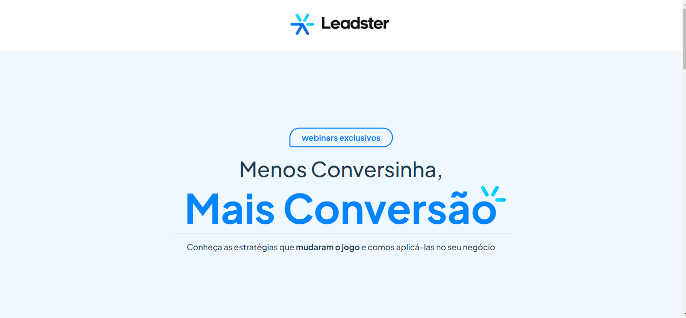

## Desafio Técnico - Landing Page

Bem-vindo! Este repositório contém minha solução para o Desafio Front-end da empresa [Leadster](https://leadster.com.br/) 
</br>




O desafio consistia na criação de uma landing page utilizando Next.js, Styled Components e recomendava-se o uso de TypeScript.

[Acesse a landig page aqui!](https://desafio-front-end-leadster.vercel.app/) 
</br>
###Experiência
Realizar este desafio técnico foi uma experiência enriquecedora, proveitosa, desafiadora e satisfatória para mim. Tomei algumas decisões para alcançar os objetivos propostos e criar uma solução eficiente e de alta qualidade.


* **Enriquecedora**: 
    >  Pois pude aprender mais sobre as bibliotecas que utilizei, além de tomar decisões que aprimoram ainda mais meus conhecimentos em front-end.  Além disso, o fato de adicionar mais um projeto ao meu portfólio é muito gratificante.

* **Proveitosa**: 
    > Pois pude unir o conhecimento que tinha em Next.js ao Styled Components. Ainda não tinha trabalhado com ambos juntos no mesmo projeto, e essa oportunidade me permitiu explorar suas integrações e funcionalidades.

*  **Desafiadora**: 
    > Pelo ffato de o projeto não ter um layout detalhado (figma) fornecido, apenas uma imagem em formato PNG. No entanto, utilizei meus conhecimentos de designer para conseguir reproduzir um layout mais fiel possivel. 
    

* **Satisfatoria**:
    > Nada é mais gratificante do que concluir um desafio e poder visualizá-lo no site, percebendo que foi desenvolvido com sucesso e mantém-se fiel ao layout apresentado e responsivo.   


</br>
### Decisões Tomadas

* **Next.js**:
    >Utilizei o Route Handlers do Next.js para simular o consumo de dados de uma API de back-end, para popular a página. 

* **TypeScript**:
    > Optei por utilizar TypeScript para adicionar tipagem estática ao projeto, o que proporciona uma melhor experiência de desenvolvimento, ajuda a evitar erros comuns e torna o código mais robusto e legível.

* **React Query**:
    > Optei em utilizar o react query na páginação dos dados pois torna muito fácil a busca, o armazenamento em cache, a sincronização dos dados e atualização. Causando uma melhor experiência para usuário que terá acesso aos dados mais rapidamente.

* **antd**:
    > Utilizei para páginação e modal a biblioteca, por ja ter components prontos o que agiliza a parte do desenvolvimento. Além da acessibilidade que ja vem em seus componentes.

* **Context API**:
    > Pensando em escalabilidade do projeto optei por iniciar a aplicação fazendo uso de context API para trafegar os dados entre componentes na aplicação.

### Organização do Código

Para organizar o código, segui uma estrutura de diretórios padrão do Next.js. Além disso, mantive um estilo de código consistente, seguindo as boas práticas de nomenclatura e formatação recomendadas pela comunidade.


### Funcionalidades

Aqui estão as principais funcionalidades implementadas na landing page e as instruções para executar o projeto localmente:

* Apresentação de uma página de destino (landing page) atrativa e responsiva.
* Listagem e pginação dos videos. 
* Redirecionamento do usuário para página da empresa ao clicar nos links da aplicação.
</br>

### Instruções

Instruções para baixar e executar a aplicação. 

1. Clone este repositório
```bash
$ git clone https://github.com/rafael93souza/desafio-front-end-leadster.git
```

2. Vá para a pasta do projeto
```bash
cd desafio-front-endleadster
```
3. Instale todas as dependências 
```bash
npm install
```
4. Execute o projeto
```bash
npm run dev
```


